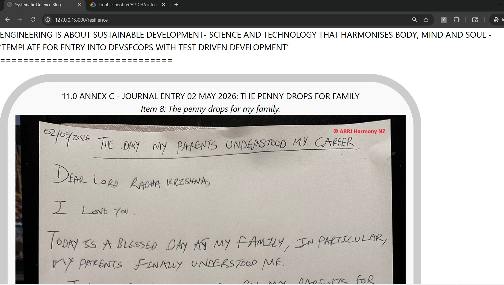
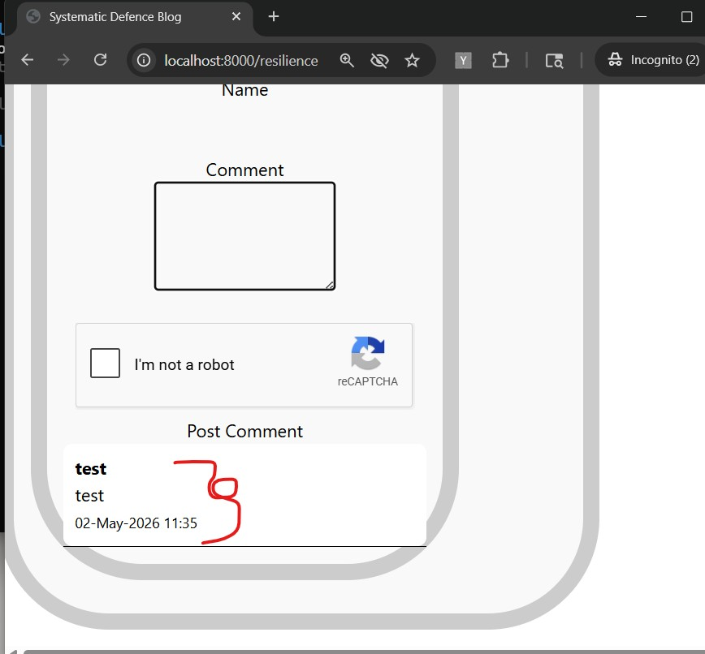
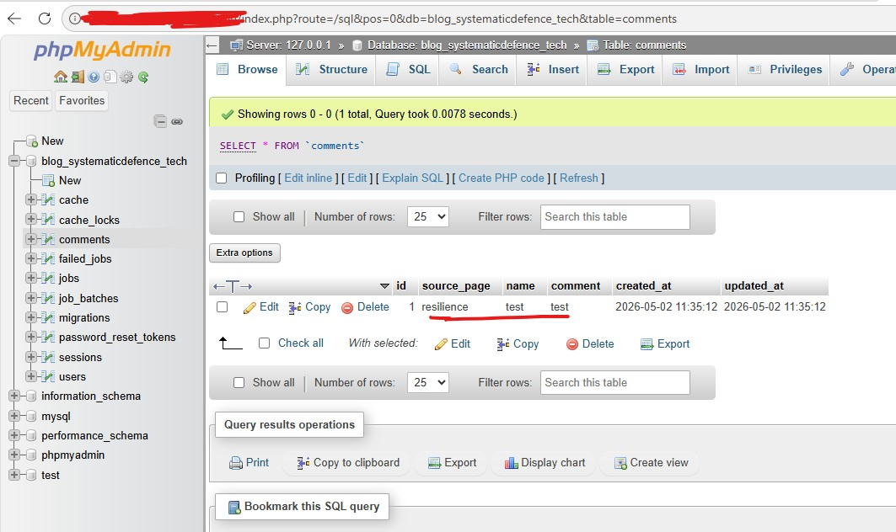

---

# Planned Project

```
blog-systematicdefence-tech/
│
├── app/
│   ├── Models/Comment.php
│   └── Http/Controllers/CommentController.php
│
├── public/
│   ├── images/
│   ├── audio/
│   ├── css/
│   └── js/
│
├── resources/
│   ├── views/
│   │   ├── resilience.blade.php
│   │   ├── professionalism.blade.php
│   │   ├── leadership.blade.php
│   │   ├── ethics.blade.php
│   │   └── components/comments.blade.php
│
├── routes/
│   └── web.php
│
└── .env
```

# Versions

## 0.1 
2 May 2026 Saturday 21:30 - First local working version of db enabled php Laravel project. It used XAMPP MySQL and Apache. .env had following values:

```
DB_CONNECTION=mysql
DB_HOST=localhost
DB_PORT=3306
DB_DATABASE=blog_systematicdefence_tech
DB_USERNAME=system-developer
DB_PASSWORD=<pwd>
```

Key commands:

1. Create a new project

```
laravel new <project name>
```

2. Create Entity Framework equivalent Migration code, i.e code for creating db tables

```
php artisan make:migration create_comments_table
```

3. Create tables (requires working connection to DB)

```
php artisan migrate
```

4. Generate Entity Framework equivalent code for Comment class

```
php artisan make:model Comment
```

4. Generate Entity Framework equivalent Controller (EF controller equivalent)

```
php artisan make:controller CommentController
```
5. How to run app:

```php
php artisan serve
```

## 0.2
2 May 2026 Saturday 23:16: CSS and Images working locally:


1. How to run Vite, which renders css:

```
npm install
npm run dev
```

-- Outcome --
 
css-and-images-working.jpg

## 1.0
2 May 2026 Saturday 23:41: Basic skeleton of application working end to end:

1. Verified that comments functionality is working, with recaptchav2.

 
css-and-images-working.jpg

2. Verified that connection to database working via app:

 
css-and-images-working.jpg


